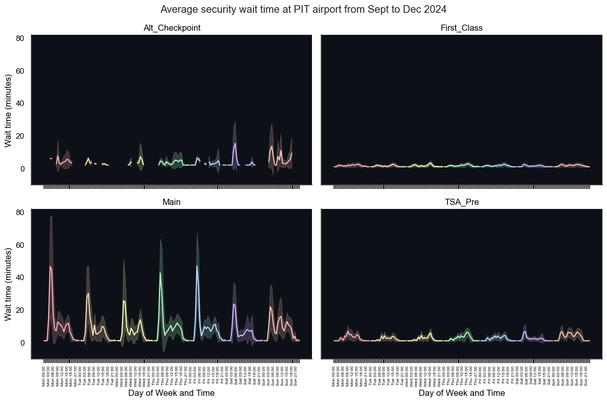

## Project: PIT_waittime_analysis

Pittsburgh International Airport (PIT) is a major airport serving the greater Pittsburgh area, situated in Moon Township. The security waiting area is located in the landside terminal, which is connected to the airside terminal by a tram system. The main security checkpoint is on the second floor of the landside terminal. Originally, there were three lines at this checkpoint: Main, First Class, and TSA PreCheck. However, with the recent addition of a Clear line in 2024, which took up some space from the general passenger line, the main security line often becomes very long during peak hours and sometimes extends out the second-floor door into the walkway.

The goal of this project is to collect and analyze security line wait time data at PIT, giving the general public an idea of what to expect for security wait times for passengers with different levels of access through the checkpoint. *Based on the author prior experience and opinion, the actual wait time from waiting in line, ID check, and security screening of personal and carry-on items tend to be longer than the posted wait time.*

This is an ongoing project with limited amount of data. Data were collected ~from Sept to Dec 2024. The pipeline is scheduled to run every 15 minute or whenever github actions have resources available to trigger the job. Sample data are plotted below by checkpoint location. When the line color is orange, it means that the checkpoint is closed or no information available. Currently, the automatic pipeline run is paused.

Disclaimer: this project is for educational/demonstrative purposes. The author has no affiliation with the sites data were scraped and collected. Therefore, the author is not responsible for the accuracy of the collected data. 
